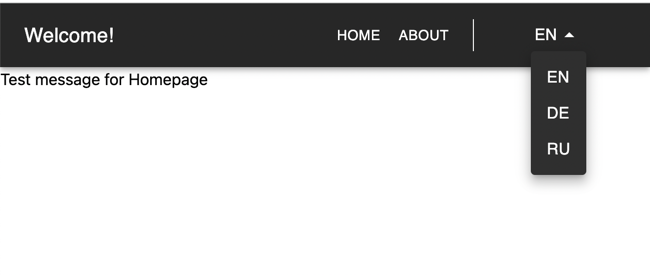

# Next.js 13 TypeScript i18n Template

This is a basic template for creating a Next.js 13 TypeScript project. It's set up with internationalization (i18n) support using the `next-translate-plugin` and Material-UI (MUI) components.

The code is based on the [library's example here](https://github.com/aralroca/next-translate/tree/master/examples/with-app-directory).

